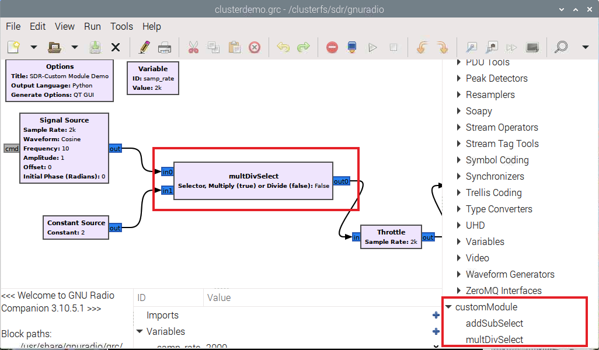

# Cluster UADER-FCyT 
# Proyecto I+D Procesamiento SDR en cluster distribuido

# Infraestructura basica
## Instalar ZeroTier

-   Bajar e instalar cliente ZeroTier desde el [sitio oficial ZeroTier](https://www.zerotier.com/download/)

-   Verificar instalacionn con
~~~
zerotier-cli Info
~~~

-   Solicitar acceso al cluster con 
~~~
zerotier-cli join ebe7fbd44582a898
~~~

-   Verificar que es funcional con 
~~~
ping 100.100.100.100
~~~
-   Usar el nombre *sdr-s00* en el DNS local para 100.100.100.100
    (master), para ello editar el archivo
~~~
sudo nano /etc/resolv.conf
~~~

## Directorio local para utilidades 

Las utilidades del sistema pueden estar en cualquiera de los siguientes
dos directorios:

~~~
-   /home/pi
-   /clusterfs/sdr
~~~

Es preferible el segundo pues es un file System NFS compartido por todos
los nodos, por lo que lo que allí se coloque será accesible desde todos
lso nodos sin necesidad de copiar explícitamente.

Por otra parte ante el fallo de la tarjeta microSD con la imagen
Raspbian queda el grueso del trabajo.

## Metodo para loggear en ssh sin password

### Generar las claves públicas y privadas de cada usuario

-   En la máquina local de cada uno generar las credenciales con el
    comando

~~~
ssh-keygen
~~~
-   Al hacerlo quedarán los archivo *id_rsa.pub* e *id_rsa* en el
    directorio *./ssh*

### Copiar la clave pública a la máquina remota

-   En la máquina local ejecutar

~~~
ssh-copy-id remote_username@remote_server_ip_address
~~~
### Entrar en la máquina remota

-   En la máquina local ejecutar

~~~
ssh remote_username@remote_server_ip_address
~~~

## Creación de nuevo usuario 

### Generar el usuario 

-   Seleccionar el usuario a generar, igual a usuario de correo electronico en UADER.

-   Generar una nueva password arbitraria con
~~~
python $SCRIPTS/pwdgen.py
~~~
-   Tipear *
~~~
sudo adduser \[usuario\]
~~~
-   Indicar password y confirmar.

### Agregar a grupo sudoers

~~~
usermod -aG sudo \[usuario\]
~~~
## Para cambiar password

-   Generar una nueva password arbitraria con 

~~~
python $SCRIPTS/pwdgen.py
~~~
-   Tipear

~~~
sudo passwd \[usuario\]
~~~
 tipear a continuacion la password  dos veces.

## Login con pi en cluster base (sdr-s00) desde el exterior

Se accede con

~~~
ssh <pi@100.100.100.100>
password \[************] (sin los \[ \])
~~~
Esta forma de acceso no es recomendada, utilizar en la medida de lo
posible la que se explica a continuación.

## Procedimiento de login

Para que el trabajo pueda ser hecho en forma cooperativa todas las
instalaciones deben ser hechas con el usuario pi en el directorio
/home/pi

Sin embargo, el método de login sin password lo hace con el usuario
individual y el directorio de comienzo es en /home/\[usuario\], para
corregirlo tipear:

~~~
sudo su pi && cd /home/pi
~~~

Se puede verificar cual es el usuario de operacion con el comando

~~~
whoami
~~~
 y el directorio de operación con el comando 
~~~
pwd
~~~

Al finalizar se puede desconectar con 
~~~
exit
~~~
## Utilidades de cluster

### Directorios exportados

Los siguientes son variables exportadas

-   $CLUSTERFS (contenido "/clusterfs/sdr")
-   $CLUSTERIP (contenido "10.0.0.")
-   $CLUSTERID (contenido "sdr-s0")

La variable *HOSTFILE* contendra el nombre completo al archivo con la
definicion corriente del cluster.
 
### Script ccp.sh

El script **ccp.sh** sirve para copiar un mismo archivo desde el nodo
base del cluster a uno o todos los nodos del mismo.

~~~
$SCRIPTS/ccp.sh {-n nodo} {archivo_origen} {path}{archivo_destino}
~~~
El comando se ejecuta con autoridad de usuario pi por lo que el destino
tiene que estar autorizado para realizar la operación de copia.

El sentido de la copia es siempre desde el nodo base (sdr-s00) al o los
que se designe como destino.

En caso de necesitar hacer copias individuales en sentido contrario
puede utilizarse

~~~
scp pi@{nodo_origen}:/(path)/(archivo) archivo
~~~

### Script cexec.sh

El script **cexec.sh** sirve para ejecutar uno o mas comandos desde el
nodo base del cluster a uno o a todos los nodos del mismo.

Para ejecutar un comando:

~~~
$SCRIPTS/cexec.sh {-n nodo} "comando1"
~~~

Para ejecutar múltiples comandos

~~~
$SCRIPTS/cexec.sh {-n nodo} "comando1 && comando2 ..... && ./comandoN"
~~~

*Script cping.sh*

El script **cping.sh** sirve para verificar el estado de todos los nodos
indicados en el archivo /etc/hosts que respondan al patrón "sdr-s\*".

~~~
$SCRIPTS/cping.sh
~~~

### Stress del sistema

Se puede inducir un stress en cualquiera de los nodos con el comando

~~~
$SCRIPTS/cstress.sh
~~~

el cual ocupará los 4 procesadores de un nodo por 900 segundos.

El mismo se puede ejecutar en forma distribuido con cexec.sh

### Sincronización de tiempo

Los nodos deben tener sincronización de tiempo por el protocolo ntp. El
mismo mantiene sincronizados los relojes con un patrón externo.

Se puede forzar una sincronización en cualquier momento con el script
~~~
$SCRIPTS/ntpd.sync
~~~

## Benchmark del cluster

### Configuración del cluster OpenMPI

Los nodos habilitados para ser utilizados por el cluster se encuentran
en *\$HOSTFILE*

El formato del archivo es

~~~
sdr-s00 slots=4
sdr-s01 slots=4
sdr-s03 slots=4
sdr-s04 slots=2
~~~

Donde se puede regular el numero de nucleos disponibles en cada nodo,
hay que tener en cuenta que en el nodo base (sdr-s00) siempre uno de los
núcleos se designa como rank 0 (master). Es conveniente que las placas
menos veloces tengan menor asignación por parte del scheduler.

### mpi4 (Python)

No es realmente un benchmark sino un test del número de cores que están
siendo vistos y utilizados por el entorno del cluster, se invoca con

~~~
$CLUSTERFS/sdr/python/mpi4/mpi4.sh
~~~

### hello_mpi (C++)

No es realmente un benchmark sino un test del número de cores que están
siendo vistos y utilizados por el entorno del cluster, se invoca con

~~~
clusterfs/sdr/lib/hello_mpi/hello_mpi.sh
~~~

Mostrandose todos los nodos que pueden subscribir trabajo de acuerdo a
la configuracion.

### primes (Python)

Calcula los numeros primos en un intervalo, se invoca con

~~~
$CLUSTERFS/sdr/python/primes/primes.sh
~~~

La comparación con el cálculo clásico en un solo nodo puede realizarse
con

~~~
python $CLUSTERFS/sdr/python/primes/primes_classic.py -l 1 -u 100000
~~~

### getpi (Python)

Calcula el número pi con diferentes precisiones, se invoca con

~~~
$CLUSTERFS/sdr/python/getpi/getpi.sh
~~~

La comparación con el cálculo clásico en un solo nodo puede realizarse
con

~~~
python $CLUSTERFS/sdr/python/getpit/getpi_classic.py -s 1000000
~~~

### collatz (C++)

Calcula la profundidad de la conjetura de Collatz para un rango
indicado, se invoca con:

~~~
$CLUSTERFS/sdr/lib/collatz.sh* *\[-m MPI\|SERIAL\] \[-s Start\] \[-e End\] \[-b Blocksize\] \[-v\]
~~~

El mismo script calcula con la versión paralelo (MPI) o serie (SERIAL).

## Benchmark de GNURadio

Se dispone de un módulo custom (OOT) accesible desde el GNU Radio
Companion denominado *customModule*.

El mismo está formado por dos componentes llamados:

-   *addSubSelect* (Python): suma el valor de trama 2 a trama 1 si *True*.
-   *multSubSelect* (C++): multiplica el valor de trama 2 por trama 1 si *True*.

En el gr companion se puede ver como

Este componente custom fue desarrollado usando el tutorial disponible para
modulos OOT (Out of Tree) en [Python](https://wiki.gnuradio.org/index.php?title=Creating_Python_OOT_with_gr-modtool)
y [C++](https://wiki.gnuradio.org/index.php?title=Creating_C%2B%2B_OOT_with_gr-modtool).

El directorio de los fuentes respectivos es
~~~
$CLUSTERFS/sdr/gnuradio/gr-customModule
~~~
